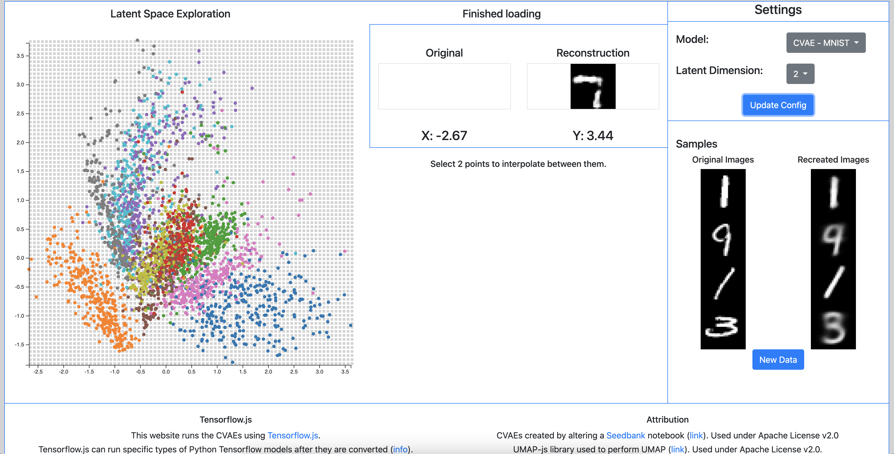

# VAE Expl
A VAE exploratory tool that displays the latent space of different CVAE's trained on MNIST and Fashion MNIST datasets with different latent dimension sizes. Written for school many moons ago. UI could definitely use an upgrade but honestly I'll probably never get to that :) .

View the website here: https://mindwrapped.github.io/vae-expl/.

#### Running Locally
To run the project start a local web server using "python -m http.server 8080".
